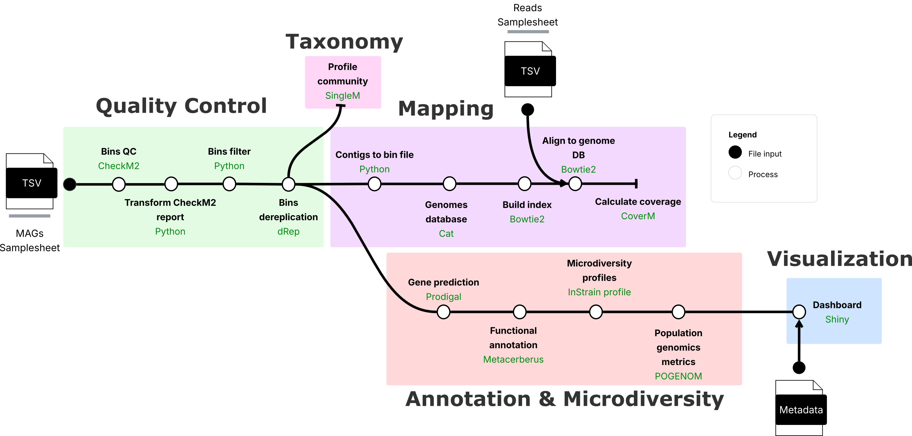

# Welcome to PopMAG Docs!

---

**Documentation**: <a href="https://daasabogalro.github.io/popmag_docs/" target="_blank">https://daasabogalro.github.io/popmag_docs/</a>

**Source Code**: <a href="https://github.com/daasabogalro/popmag" target="_blank">https://github.com/daasabogalro/popmag</a>

---

**PopMAG** is a pipeline that integrates genome-resolved metagenomics data with population genomics tools to analyze metagenome-assembled genomes (MAGs) and their population-level variations. The pipeline processes MAGs alongside paired-end sequencing short reads to perform quality assessment, abundance profiling, variant calling, and population genomics analyses, ending in an interactive visualization dashboard built with shiny.

PopMAG can aid to understand both the functional potential and population dynamics of metagenome-assembled genomes, particularly in the context of comparative genomics and temporal or spatial studies.

!!! info
    This project is under active development.

## Pipeline Phases

The pipeline is organized into **five main phases**:



### Phase Descriptions

| Phase                      | Description                                                                       | Key Tools                       |
| -------------------------- | --------------------------------------------------------------------------------- | ------------------------------- |
| **1. Quality Control**     | Assess MAG quality, filter by completeness/contamination, and dereplicate genomes | CheckM2, dRep                   |
| **2. Profiling**           | Profile microbial communities and calculate genome abundances                     | SingleM, CoverM                 |
| **3. Variant Calling**     | Align reads to MAGs and identify single nucleotide variants                       | Bowtie2, InStrain               |
| **4. Population Genomics** | Predict genes, annotate functions, and calculate population genetics metrics      | Prodigal, MetaCerberus, POGENOM |
| **5. Visualization**       | Interactive exploration of results through a Shiny dashboard                      | R Shiny                         |

## Key Features

- **End-to-end analysis**: From MAGs and metagenomic sequencing reads to population genetics metrics
- **Quality filtering**: Automated filtering based on **CheckM2** completeness and contamination scores
- **Genome dereplication**: Remove redundant genomes using **dRep**
- **Variant detection**: Identify SNVs at the population level with **InStrain**
- **Functional annotation**: Annotate genes with **MetaCerberus** using multiple databases
- **Population metrics**: Calculate FST with **POGENOM** and other population genetics statistics with **InStrain**
- **Interactive visualization**: Explore results through an integrated **Shiny dashboard**
- **Scalable**: Built on **Nextflow** for seamless execution on local machines, clusters, or cloud

## Quick Start

Prepare your input samplesheets and run:

```bash
nextflow run daasabogalro/PopMAG \
    -profile docker \
    --mag_paths mags_samplesheet.tsv \
    --reads_paths reads_samplesheet.tsv \
    --metadata metadata.csv \
    --outdir results
```

See the [Getting Started](started.md) guide for detailed installation instructions and the [Usage](usage.md) page for samplesheet preparation.

## Credits

PopMAG was developed by [Daniel Sabogal](https://github.com/daasabogalro) under the supervision of [Alejandro Caro-Quintero](https://holobionts.xyz/team/#prof-alejando-caro-quintero) at the [Max Planck Tandem Group in Holobiont Research](https://holobionts.xyz), Universidad Nacional de Colombia.

## License

PopMAG is released under the MIT License. See the [LICENSE](https://github.com/daasabogalro/PopMAG/blob/main/LICENSE) file for details.
